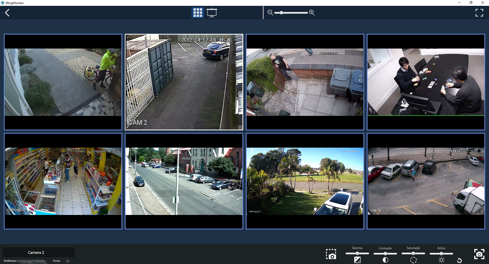

# BlingMonitor
**A camera surveillance system aimed at HTTP streams**

The GUI is made with recent versions of [JavaFX](https://openjfx.io/), 
while the visualization of the cameras is based on [VLCJ 4](https://github.com/caprica/vlcj).
Works really well together with [Motion](https://motion-project.github.io/) as the 
server for the cameras, since it streams HTTP as default.

Both for Linux and Windows.

A minimum amount of gpu resource it's necessary for the 

##Features

* **Grid-mode**: group all registered cameras to fit in a maximized screen
* **Slide-mode**: show each camera individually and slide it after a certain time
* Group up to 10 cameras in the visualization grid
* Auto scan: searches for cameras connected on the network, given an IP. Supports custom range of IP's and ports. 
* Detects when a camera goes down and reconnects automatically once is up again
* Change brightness, contrast, hue and gama of each camera for better visualization
* Assign a custom name to each camera
* Save frames from any camera
* Change the size of the camera's grid
* Full screen mode
* Readjust automatically to window resize (just the arrangement, not the size, for now)

Although not tested, theoretically it supports any kind of video stream, since it's VLC based.
Any stream that VLC can play, BlingMonitor can do it too.
Keep in mind that this can only be possible if registering the camera
manually, as the auto scan just checks for open ports in the network. 

##Requirements
* [VLC](https://www.videolan.org/vlc/index.html). On linux, recommend *not* using the snap version,
but instead, the one that your package manager provides. `sudo apt-get install vlc`
* [Java](https://www.oracle.com/br/java/technologies/javase-downloads.html) version 13+ recommended.

